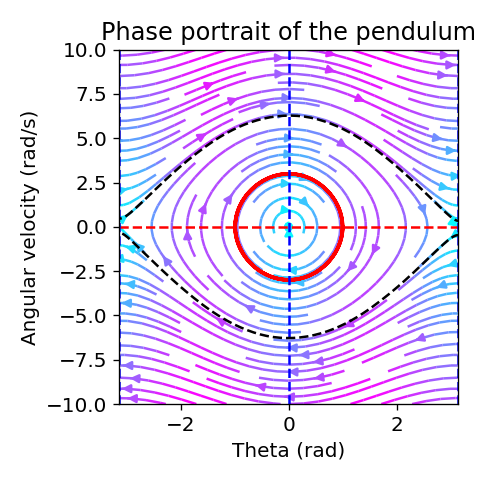
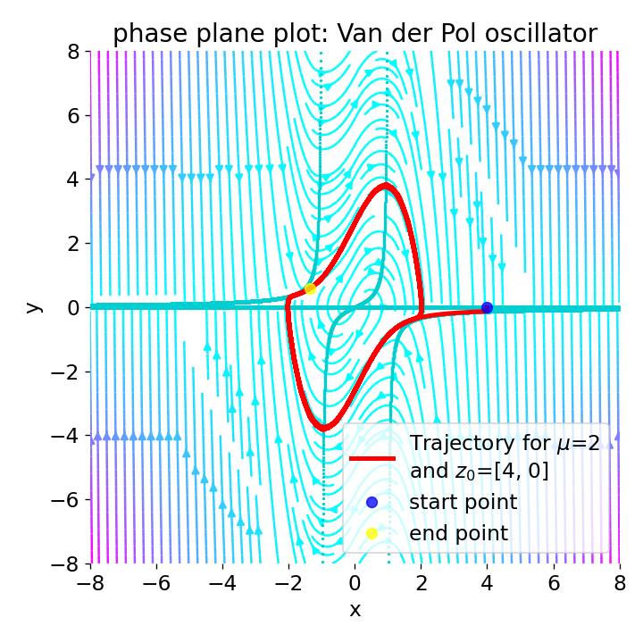
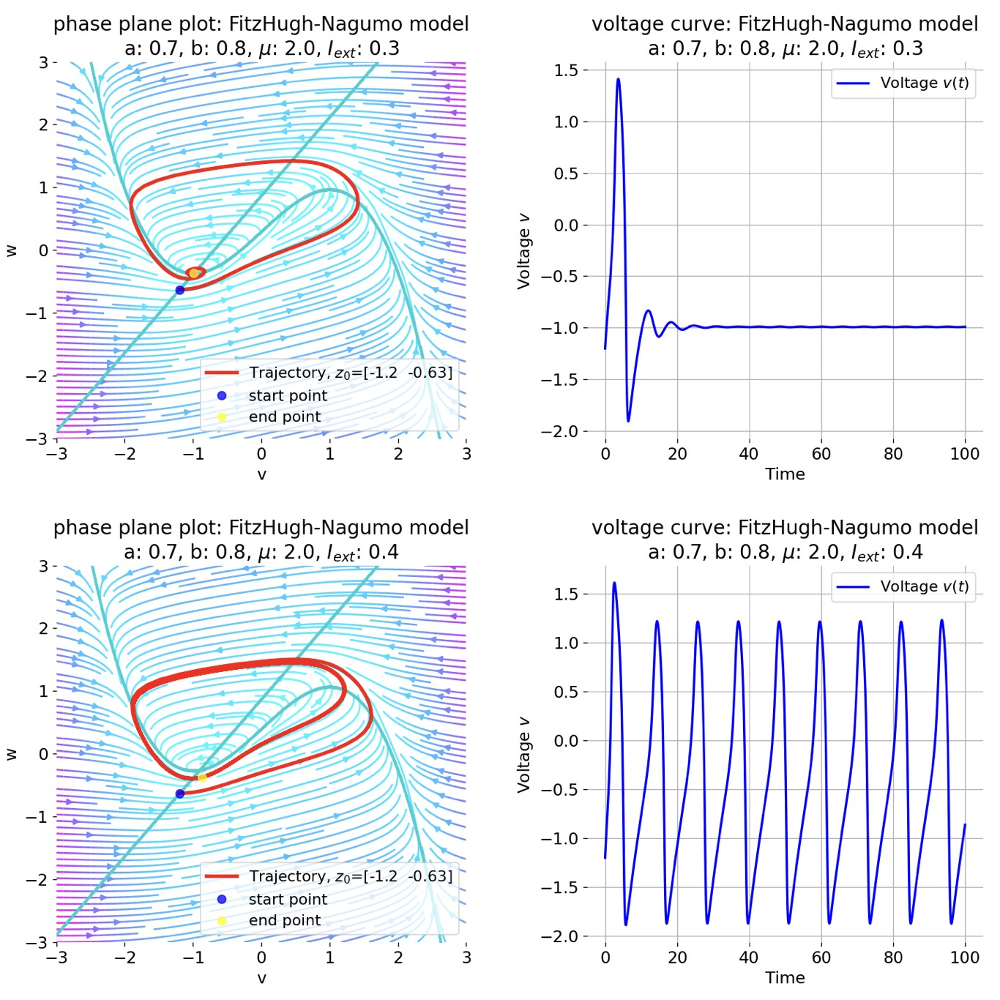

# Phase plane analysis

Python scripts supporting tutorials on phase plane analysis. For more details, see these blog posts:

* [Using phase plane analysis to understand dynamical systems](https://www.fabriziomusacchio.com/blog/2024-03-17-phase_plane_analysis/)
* [The Van der Pol oscillator](https://www.fabriziomusacchio.com/blog/2024-03-24-van_der_pol_oscillator/)

For reproducibility:

```bash
conda create -n phaseplane -y python=3.11
conda activate phaseplane
conda install -y mamba
mamba install -y ipykernel numpy matplotlib scipy
```






